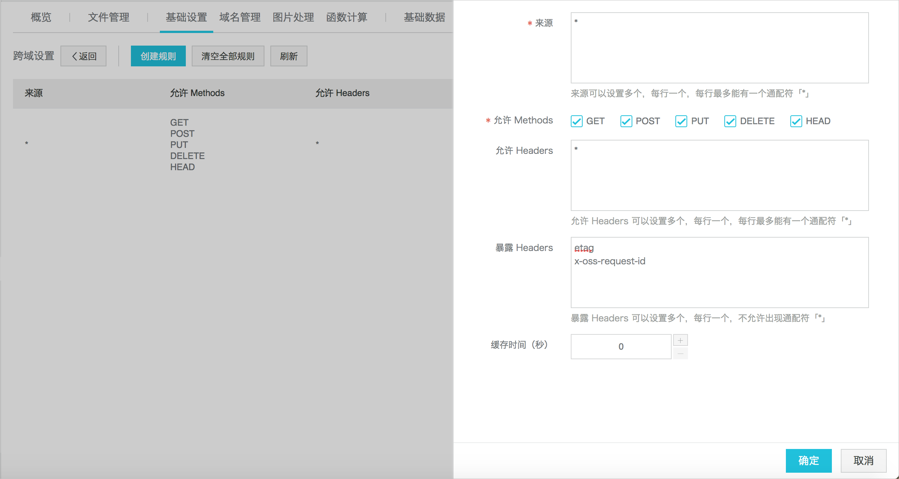
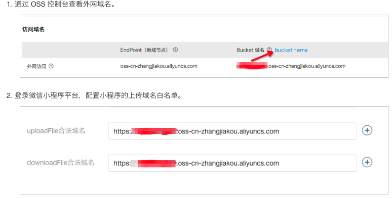

# wchatapp-oss
小程序直传oss实例

#使用方法

1. 请登录oss,配置bucket跨域

2. 配置外网域名到小程序的上传域名白名单中

3. 将lib下文件复制粘贴到你的项目

4. 将http.js中accessid,accesskey,host,替换成你所申请id,key,host地址

5. 可直接引入http.js到你需要的使用的文件中使用upFileOss方法,也可复制需要的代码到你的请求模块中

#备注
1. 视频图片皆可上传

2. 参考链接
